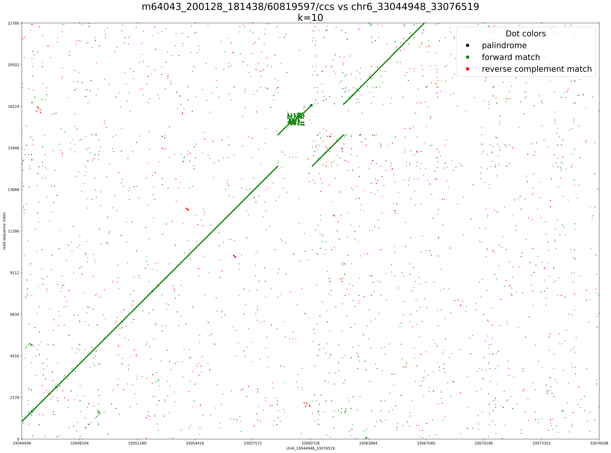

## Dotplot of a long read sequence 
- sparse matrix generated with wotplot (https://github.com/fedarko/wotplot) :+1: :+1:
- This png plot was adapted from wotplot as well
  

## Dotplot of a long read sequence, with cigar based coloring

## Dotplot of a long read sequence, displaying primary + 2 SA algnments 

