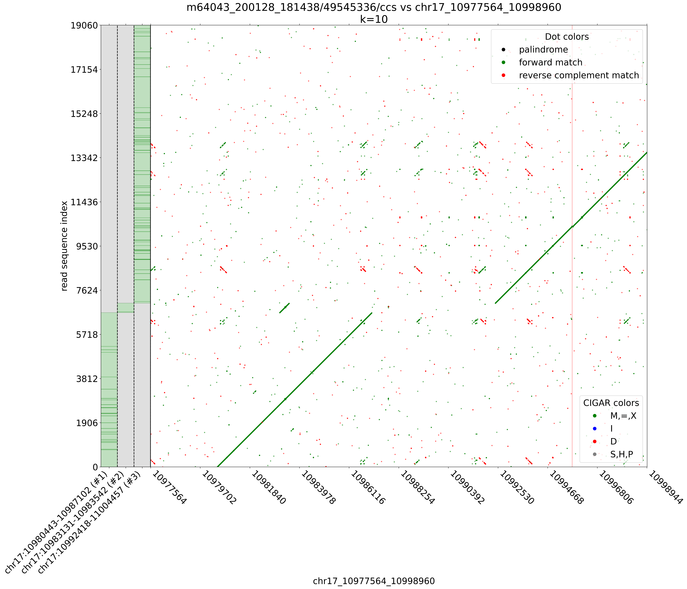

## Dotplot of a long read sequence 
- sparse matrix generated with wotplot (https://github.com/fedarko/wotplot) :+1: :+1:
-  png plot was adapted from wotplot as well
  

## Dotplot of a long read sequence, with cigar based coloring

## Dotplot of a long read sequence, displaying primary + 2 SA alignments 

## Dotplot of t2t chrY against itself, itertating from k=5000 to k=400
